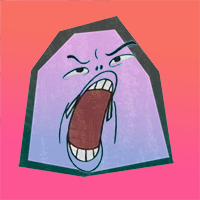

# kwiplash

## Written by Jordan Bleu



### What is this

Kwiplash is a discord / chat based ripoff of Quiplash.  There's a few differences but overall I made it pretty much the same experience, even including snarky remarks :)

The code is pretty bad, mainly because I don't know node.js very well and I wrote the bot in a few hours.  But it works.  

### How to play

See [Rules.](./rules.md)

### How to host this bot

Personally I have it hosted on my Raspberry Pi, but any computer should work. 

1. Set up a new application + bot in the Discord Developer portal.  It will need the Server Members Intent and the Message Content intent. 
2. Pull down this code and put it somewhere on your server / raspberry pi / whatever
3. Create a new file called 'config.json' and place it in the root directory.  It needs to look something like this, with your bot's api token / client id.
```json
{
    "token": "put-ur-token-here",
    "clientId": "put-client-id-here"
}
```
As of this writing, you can get the client id by `Discord Developer portal > (your application) > General Information tab > Application Id`

And the token can be generated via `Discord Developer portal > (your application) > Bot tab > Reset Token`

4. **If you're hosting for the first time** you will need to run the deploy-commands.js script.  To do so, simply run `node deploy-commands.js`.  This only needs to happen once, after you create your bot in the discord developer tool.
5. Run `npm install` to pull all the dependencies
6. Run `node index.js` to start the server 
7. Add the bot to your server, it will need admin privileges to delete it's old messages and keep your text chat clean.
8. Use the `/Kwiplash` command in Discord to start a new game!

### Adding custom prompts

You can easily add as many prompts as you want by editing prompts.json :)


