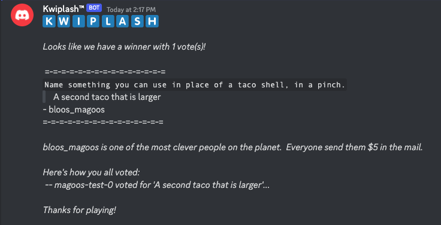

# How to play Kwiplash

## Starting the game

To start a game, simply type `/kwiplash` into chat:

The game will then begin, with a randomly selected prompt.

## Submitting a prompt

To submit a prompt and join the game, click the "Submit an answer" button.  You will be presented with a modal window:

Type a witty response to the prompt and click the submit button.

No more than 8 players may join a single round, but anyone can vote for responses!

## Voting

After 45 seconds, the Kwiplash bot will send another message asking for votes.  Each player's response will be laid out anonymously for others to vote on.  

You can not vote for yourself, and you only get one vote.  Clicking multiple buttons will simply update your vote.  

## Final round

After 15 seconds, the final tally will be displayed, and the winner will be announced!

